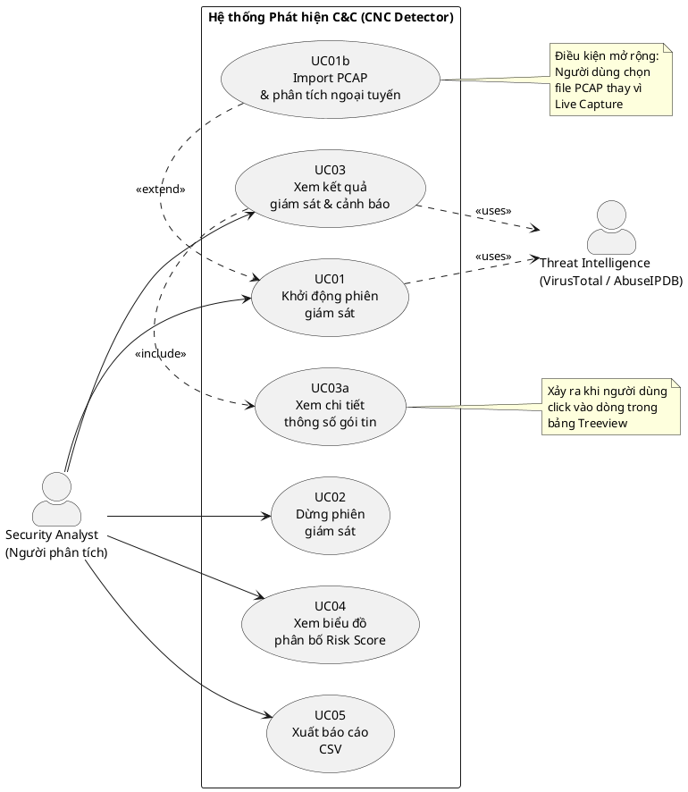

# ĐẶC TẢ USE CASE — HỆ THỐNG PHÁT HIỆN MÁY CHỦ C&C
## Dành cho AI thực thi — Phân tích đầy đủ cấu trúc & sơ đồ

---

## PHẦN 1: PHÊ PHÁN BẢN USE CASE CŨ — NHỮNG GÌ SAI VÀ CẦN BỎ

> **Bối cảnh**: Bản mục lục trước định nghĩa 12 Use Case (UC01–UC12). Dưới đây là danh sách lỗi nghiêm trọng theo chuẩn UML.

### ❌ Lỗi 1 — UC07 đến UC12 KHÔNG PHẢI use case (lỗi nghiêm trọng nhất)

Trong UML, **Use Case = chức năng mà hệ thống cung cấp cho Actor bên ngoài thấy và sử dụng được**.
Các mục UC07–UC12 mô tả **luồng xử lý nội bộ** của hệ thống (pipeline kỹ thuật):

| UC cũ | Thực chất là gì | Đúng phải để ở đâu |
|---|---|---|
| UC07: Bắt gói tin | Hàm nội bộ `PacketSniffer._live_loop()` | Sequence Diagram / Activity Diagram |
| UC08: XGBoost phân loại | Hàm nội bộ `FlowAnalyzer.predict()` | Sequence Diagram |
| UC09: Bi-LSTM DGA | Hàm nội bộ `DGADetector.predict()` | Sequence Diagram |
| UC10: Risk Scoring | Hàm nội bộ `RiskScorer.calculate()` | Sequence Diagram |
| UC11: Threat Intel | Hàm nội bộ `ThreatIntelligence.check_ip()` | Sequence Diagram |
| UC12: Process Mapping | Hàm nội bộ `ProcessMapper.get_all_connections()` | Sequence Diagram |

→ **Xóa UC07–UC12 khỏi Use Case Diagram. Chuyển sang Sequence Diagram.**

### ❌ Lỗi 2 — "AI Engine" và "OS" là actor sai

- **"AI Engine"**: là thành phần BÊN TRONG hệ thống (các module Python). Không phải actor ngoài.
- **"OS" (hệ điều hành Windows)**: không tương tác trực tiếp với use case nào mà người dùng thực hiện. Nó là môi trường chạy, không phải actor UML.

### ❌ Lỗi 3 — UC02 và UC01 có thể gộp thành một

"Khởi động giám sát" bao gồm cả chọn nguồn dữ liệu (Live hoặc PCAP). Tách UC01/UC02 quá vụn vặt.
→ Gộp thành **UC01: Khởi động phiên giám sát** (có <<extend>> cho trường hợp chọn PCAP).

### ❌ Lỗi 4 — Thiếu actor "Hệ thống Threat Intelligence ngoài" (VirusTotal, AbuseIPDB)

Đây là **secondary actor** thực sự — hệ thống bên ngoài cung cấp dịch vụ. Cần thể hiện trên sơ đồ.

### ✅ Kết luận: Chỉ có 5 Use Case thực sự (từ góc nhìn người dùng)

| UC | Tên | Actor chính |
|---|---|---|
| UC01 | Khởi động phiên giám sát (chọn chế độ Live/PCAP) | Security Analyst |
| UC02 | Dừng phiên giám sát | Security Analyst |
| UC03 | Xem kết quả giám sát và cảnh báo | Security Analyst |
| UC04 | Xem biểu đồ phân bố điểm rủi ro | Security Analyst |
| UC05 | Xuất báo cáo CSV | Security Analyst |

---

## PHẦN 2: CẤU TRÚC ĐẦY ĐỦ CỦA PROJECT

```
cnc-detector/
├── main.py                        # GUI chính (CustomTkinter) — CNCDetectorApp class
├── requirements.txt               # Danh sách thư viện Python
├── run_cnc_detector.bat/.sh       # Script khởi động
├── models/                        # Thư mục chứa file trọng số AI
│   ├── xgboost_flow_model.joblib  # Mô hình XGBoost đã train
│   ├── flow_scaler.joblib         # StandardScaler cho XGBoost
│   ├── bilstm_dga_model.keras     # Mô hình Bi-LSTM đã train
│   └── char_map.npy               # Bảng mapping ký tự cho Bi-LSTM
├── data/
│   └── threat_intel_cache.json    # Cache kết quả Threat Intelligence (TTL=1h)
└── modules/
    ├── __init__.py
    ├── packet_sniffer.py          # Module bắt gói tin & trích xuất luồng
    ├── flow_analyzer.py           # Module XGBoost phân loại luồng mạng
    ├── dga_detector.py            # Module Bi-LSTM phát hiện DGA
    ├── threat_intel.py            # Module tra cứu IoC (VT API + AbuseIPDB)
    ├── process_mapper.py          # Module ánh xạ tiến trình OS
    └── risk_scorer.py             # Module tính điểm rủi ro tổng hợp
```

### Sơ đồ phụ thuộc module (Dependency Graph)

```
main.py (GUI — CNCDetectorApp)
  ├── imports PacketSniffer      ← packet_sniffer.py
  ├── imports FlowAnalyzer       ← flow_analyzer.py  [depends: xgboost, sklearn, joblib]
  ├── imports DGADetector        ← dga_detector.py   [depends: tensorflow/keras]
  ├── imports ThreatIntelligence ← threat_intel.py   [depends: requests]
  ├── imports ProcessMapper      ← process_mapper.py [depends: psutil]
  └── imports RiskScorer         ← risk_scorer.py    [no external deps]

PacketSniffer (packet_sniffer.py)
  ├── Live mode: psutil.net_connections() → ConnectionTracker
  └── PCAP mode: scapy (primary) → dpkt (fallback) → raw binary (fallback)
```

### Luồng dữ liệu chính (Data Flow — xảy ra hoàn toàn nội bộ)

```
[Mạng/PCAP] → PacketSniffer.callback(flow_data)
                    ↓
              CNCDetectorApp.process_flow(flow_data)
                    ├── FlowAnalyzer.predict(flow["flow"])         → flow_res
                    ├── DGADetector.predict(flow["domain"])        → dga_res
                    ├── ThreatIntelligence.check_ip(flow["remote_ip"]) → ti_res
                    └── (ProcessMapper inline check)               → proc_flags
                    ↓
              RiskScorer.calculate(flow_res, dga_res, ti_res, proc_flags)
                    ↓ AlertRecord
              CNCDetectorApp.update_ui_logs(flow_data, alert)
                    ↓
              [Treeview + Alert Panel cập nhật]
```

### Cấu trúc dữ liệu quan trọng

**`flow_data` dict** (PacketSniffer → GUI):
```python
{
  "remote_ip": str,      # IP đích của kết nối
  "remote_port": int,    # Cổng đích
  "domain": str,         # Tên miền (từ DNS cache hoặc reverse DNS)
  "process": str,        # Tên tiến trình tạo kết nối
  "pid": int,            # Process ID
  "category": str,       # "LIVE" hoặc "PCAP"
  "source": str,         # "LIVE" hoặc "PCAP"
  "timestamp": float,    # Unix timestamp
  "flow": {              # 34 đặc trưng khớp với CICIDS2017
    "flow_duration": float,        # ms
    "total_fwd_packets": int,
    "total_bwd_packets": int,
    "fwd_packet_length_mean": float,
    "bwd_packet_length_mean": float,
    "flow_bytes_per_sec": float,
    "flow_packets_per_sec": float,
    "flow_iat_mean": float,        # ms — quan trọng nhất cho Beaconing
    "flow_iat_std": float,         # ms — CV = std/mean < 0.3 → Beaconing
    "flow_iat_max": float,
    "flow_iat_min": float,
    "packet_length_mean": float,
    "packet_length_std": float,
    "packet_length_variance": float,
    "fwd_iat_mean": float,
    "fwd_iat_std": float,
    "bwd_iat_mean": float,
    "active_mean": float,          # ms
    "idle_mean": float,            # ms — cao = dấu hiệu Beaconing
    "syn_flag_count": int,
    "ack_flag_count": int,
    "fin_flag_count": int,
    "rst_flag_count": int,
    "fwd_psh_flags": int,
    "bwd_psh_flags": int,
    "fwd_header_length": int,
    "bwd_header_length": int,
    "fwd_packets_per_sec": float,
    "bwd_packets_per_sec": float,
    "min_packet_length": float,
    "max_packet_length": float,
    "urg_flag_count": int,
    "avg_fwd_segment_size": float,
    "avg_bwd_segment_size": float,
  }
}
```

**`AlertRecord` dataclass** (RiskScorer → GUI):
```python
@dataclass
class AlertRecord:
    timestamp: str           # "YYYY-MM-DD HH:MM:SS"
    remote_ip: str
    remote_port: int
    domain: str
    process_name: str
    process_pid: int
    risk_score: float        # 0.0 → 100.0
    alert_level: str         # "SAFE"|"LOW"|"MEDIUM"|"HIGH"|"CRITICAL"
    alert_color: str         # hex color
    flow_score: float        # đóng góp từ XGBoost (0-100)
    dga_score: float         # đóng góp từ Bi-LSTM (0-100)
    threat_intel_score: float
    process_score: float
    malware_family: str      # "Emotet", "Cobalt Strike", "Unknown"...
    details: list[str]       # ["🔴 XGBoost: ...", "⏱️ Beaconing: ..."]
    mitre_techniques: list[str]  # ["T1071", "T1568.002", "T1055"]
```

---

## PHẦN 3: SƠ ĐỒ USE CASE CHÍNH XÁC

### 3.1 Danh sách Actor thực sự

| Actor | Loại | Mô tả |
|---|---|---|
| **Người phân tích bảo mật** (Security Analyst) | Primary Actor | Người dùng duy nhất tương tác trực tiếp với hệ thống |
| **Hệ thống Threat Intelligence** (VT / AbuseIPDB) | Secondary Actor | API bên ngoài cung cấp thông tin IoC khi hệ thống gọi |

> **Lưu ý cho AI vẽ sơ đồ**: Người dùng ở bên trái, Hệ thống TI ở bên phải (secondary actor). Ranh giới hệ thống (system boundary) bao quanh tất cả 5 use case.

### 3.2 Sơ đồ Use Case (mô tả dạng text để AI vẽ UML)

```
┌─────────────────────────────────────────────────────────────────┐
│              HỆ THỐNG PHÁT HIỆN C&C (CNC Detector)             │
│                                                                 │
│   ┌──────────────────────────────────────────┐                 │
│   │  UC01: Khởi động phiên giám sát          │                 │
│   │        (chọn chế độ Live hoặc PCAP)      │◄──┐            │
│   └──────────────────────────────────────────┘   │            │
│              ▲ <<include>>  ▲                     │            │
│              │              │ <<extend>>           │            │
│   ┌──────────┴──────┐  ┌────┴──────────────────┐  │            │
│   │  UC01a: Giám    │  │  UC01b: Import file   │  │            │
│   │  sát live       │  │  PCAP và phân tích    │  │            │
│   │  (psutil)       │  │  ngoại tuyến          │  │            │
│   └─────────────────┘  └───────────────────────┘  │            │
│                                                    │            │
│   ┌──────────────────────────────────────────┐     │            │
│   │  UC02: Dừng phiên giám sát               │◄────┤            │
│   └──────────────────────────────────────────┘     │            │
│                                              [Security          │
│   ┌──────────────────────────────────────────┐  Analyst]        │
│   │  UC03: Xem kết quả giám sát và cảnh báo  │◄────┤            │
│   └──────────────────────────────────────────┘     │            │
│              ▲ <<include>>                          │            │
│   ┌──────────┴──────────────────────────────────┐  │            │
│   │  UC03a: Xem chi tiết thông số gói tin        │  │            │
│   │         (khi click vào dòng trong bảng)      │  │            │
│   └──────────────────────────────────────────────┘  │            │
│                                                     │            │
│   ┌──────────────────────────────────────────┐     │            │
│   │  UC04: Xem biểu đồ phân bố Risk Score    │◄────┤            │
│   └──────────────────────────────────────────┘     │            │
│                                                     │            │
│   ┌──────────────────────────────────────────┐     │            │
│   │  UC05: Xuất báo cáo CSV                  │◄────┘            │
│   └──────────────────────────────────────────┘                  │
│                                                                 │
│        [UC01, UC03 có quan hệ <<uses>> với]                     │
└────────────────────────────────────┬────────────────────────────┘
                                     │ <<uses>>
                              [Hệ thống Threat Intelligence]
                              (VirusTotal API / AbuseIPDB API)
```

### 3.3 Quan hệ giữa các Use Case

| Quan hệ | Use Case nguồn | Use Case đích | Ý nghĩa |
|---|---|---|---|
| `<<extend>>` | UC01b (Import PCAP) | UC01 (Khởi động) | PCAP là trường hợp mở rộng của khởi động |
| `<<include>>` | UC03 (Xem kết quả) | UC03a (Xem chi tiết gói tin) | Click vào dòng luôn kèm cập nhật sidebar |
| `<<uses>>` | UC01 | Hệ thống Threat Intelligence | Trong quá trình giám sát, TI API được gọi tự động |

---

## PHẦN 4: BẢNG ĐẶC TẢ USE CASE CHI TIẾT (CHUẨN UML)

---

### UC01 — Khởi động phiên giám sát

| Trường | Nội dung |
|---|---|
| **Mã UC** | UC01 |
| **Tên** | Khởi động phiên giám sát |
| **Actor chính** | Security Analyst |
| **Actor phụ** | Hệ thống Threat Intelligence (VirusTotal, AbuseIPDB) |
| **Mục tiêu** | Bắt đầu thu thập và phân tích lưu lượng mạng để phát hiện C&C |
| **Điều kiện tiên quyết** | (1) Ứng dụng đã khởi động; (2) Mô hình AI đã được tải xong (nút "BẮT ĐẦU" không còn `state=disabled`) |
| **Hậu điều kiện thành công** | Thread `PacketSniffer` đang chạy nền; bảng dữ liệu bắt đầu hiển thị luồng mạng; nút chuyển thành "⏹ DỪNG GIÁM SÁT" màu đỏ |
| **Hậu điều kiện thất bại** | Nút giữ nguyên trạng thái; log hiển thị thông báo lỗi |

**Luồng cơ bản (Basic Flow — chế độ Live Capture):**

| Bước | Người dùng | Hệ thống |
|---|---|---|
| 1 | Kiểm tra dropdown "Chế độ hoạt động" = "live_capture" | — |
| 2 | Nhấn nút "▶ BẮT ĐẦU GIÁM SÁT" | — |
| 3 | — | Gọi `toggle_sniffing()` |
| 4 | — | Đặt `self.is_running = True` |
| 5 | — | Gọi `self.sniffer.start_live()` → tạo thread `LiveSniffer` |
| 6 | — | Thread `LiveSniffer` gọi `psutil.net_connections(kind='inet')` mỗi 2 giây |
| 7 | — | Với mỗi kết nối ESTABLISHED: cập nhật `ConnectionTracker`, tính 34 đặc trưng |
| 8 | — | Gọi callback `on_packet_captured(flow_data)` → `self.after(0, process_flow)` |
| 9 | — | `process_flow()` lần lượt gọi: `FlowAnalyzer`, `DGADetector`, `ThreatIntelligence`, `RiskScorer` |
| 10 | — | `update_ui_logs()` chèn hàng vào Treeview với màu theo `alert_level` |
| 11 | — | Nút đổi thành "⏹ DỪNG GIÁM SÁT" (border_color="#ef4444") |

**Luồng thay thế A — chế độ PCAP (UC01b <<extend>> UC01):**

| Bước | Người dùng | Hệ thống |
|---|---|---|
| A1 | Nhấn "📂 IMPORT PCAP" | — |
| A2 | — | Mở `filedialog.askopenfilenames()` lọc `*.pcap *.pcapng *.cap` |
| A3 | Chọn một hoặc nhiều file PCAP | — |
| A4 | — | Thêm file vào `self.pcap_files` dict; cập nhật dropdown values |
| A5 | Chọn tên file trong dropdown | — |
| A6 | Nhấn "▶ BẮT ĐẦU GIÁM SÁT" | — |
| A7 | — | Gọi `self.sniffer.start_pcap(filepath)` → thread `PcapSniffer` |
| A8 | — | `_pcap_loop()` thử scapy → dpkt → binary parser theo thứ tự ưu tiên |
| A9 | — | Gom gói tin theo 5-tuple, tính đặc trưng thực từ timestamps/sizes thực |
| A10 | — | Gọi callback với `flow_data["source"]="PCAP"`, delay 0.3s/flow |

**Luồng ngoại lệ:**

| Điều kiện | Xử lý |
|---|---|
| File PCAP không tồn tại | `log_message("System", "⚠️ Không tìm thấy file: ...")` |
| Npcap chưa cài (Live mode) | `psutil.AccessDenied` → log lỗi, thread dừng |
| File PCAP không hợp lệ (magic bytes sai) | `_parse_pcap_binary()` in "[Sniffer] File không phải PCAP hợp lệ" |
| TensorFlow không hỗ trợ CPU (thiếu AVX) | `DGADetector` tự động fallback sang heuristic-only mode |
| API Timeout (VirusTotal/AbuseIPDB) | `ThreatIntelligence` trả về kết quả từ Local IOC DB |

---

### UC02 — Dừng phiên giám sát

| Trường | Nội dung |
|---|---|
| **Mã UC** | UC02 |
| **Tên** | Dừng phiên giám sát |
| **Actor chính** | Security Analyst |
| **Mục tiêu** | Kết thúc thu thập dữ liệu, giải phóng tài nguyên |
| **Điều kiện tiên quyết** | Hệ thống đang ở trạng thái giám sát (`self.is_running = True`) |
| **Hậu điều kiện** | Thread sniffer dừng; `ConnectionTracker` được reset; nút trở về "▶ BẮT ĐẦU" màu xanh lá; dữ liệu đã thu thập vẫn còn trong bảng |

**Luồng cơ bản:**

| Bước | Người dùng | Hệ thống |
|---|---|---|
| 1 | Nhấn "⏹ DỪNG GIÁM SÁT" | — |
| 2 | — | Gọi `toggle_sniffing()` với `self.is_running = True` |
| 3 | — | Đặt `self.is_running = False` |
| 4 | — | Gọi `self.sniffer.stop()` → đặt `_running = False`, join thread (timeout=3s) |
| 5 | — | Reset `ConnectionTracker()` và xóa `_seen_connections` |
| 6 | — | Nút đổi lại "▶ BẮT ĐẦU GIÁM SÁT" (border_color="#10b981") |
| 7 | — | Log: "Dừng giám sát." |

**Luồng thay thế — đổi chế độ khi đang chạy:**

| Bước | Người dùng | Hệ thống |
|---|---|---|
| T1 | Thay đổi dropdown (ví dụ từ Live → PCAP) khi đang chạy | — |
| T2 | — | `on_mode_changed()` được kích hoạt |
| T3 | — | Gọi `sniffer.stop()` ngầm (không đổi nút UI) |
| T4 | — | Thread mới khởi động sau 0.5s với chế độ mới |

---

### UC03 — Xem kết quả giám sát và cảnh báo

| Trường | Nội dung |
|---|---|
| **Mã UC** | UC03 |
| **Tên** | Xem kết quả giám sát và cảnh báo |
| **Actor chính** | Security Analyst |
| **Mục tiêu** | Quan sát luồng mạng, nhận diện kết nối đáng ngờ, xem cảnh báo chi tiết |
| **Điều kiện tiên quyết** | UC01 đã kích hoạt; có ít nhất một luồng được xử lý |
| **Hậu điều kiện** | Người dùng đã xem được thông tin; `packet_features_map` lưu đặc trưng của dòng được chọn |

**Mô tả giao diện Treeview (bảng chính):**
- 7 cột: `Time | Process | Target IP | Port | Domain | Risk | Level`
- Màu sắc theo `alert_level`:
  - CRITICAL: nền `#7f1d1d`, chữ `#fca5a5`
  - HIGH: nền `#7c2d12`, chữ `#fdba74`
  - MEDIUM: nền `#713f12`, chữ `#fde047`
  - LOW: nền `#1e3a8a`, chữ `#93c5fd`
  - SAFE: nền `#0f172a`, chữ `#86efac`
  - SYSTEM (log): nền `#1e293b`, chữ `#94a3b8`
- Tự cuộn xuống dòng mới nhất (`yview_moveto(1)`)
- Xóa dòng cũ nhất khi vượt 1000 dòng

**Panel cảnh báo (Alert Panel) — phía dưới màn hình:**
- Tiêu đề: "🚨 CẢNH BÁO BẢO MẬT HỆ THỐNG (CRITICAL/HIGH)"
- Chỉ hiển thị `alert_level ∈ {CRITICAL, HIGH}`
- Nội dung mỗi cảnh báo:
  ```
  [timestamp] 🚨 PHÁT HIỆN C&C - MỨC {LEVEL} ({score}/100)
     ├── Target: {ip}:{port} ({domain})
     ├── Process: {name} (PID: {pid})
     ├── Malware Family: {family}      ← chỉ hiện nếu != "Unknown"
     ├── 🔴 XGBoost: ...
     ├── 🔴 DGA: ...
     └── 🔴 Threat Intel: ...
  ```

**Luồng con UC03a — Xem chi tiết thông số gói tin (<<include>>):**

| Bước | Người dùng | Hệ thống |
|---|---|---|
| 1 | Click vào một dòng trong Treeview | — |
| 2 | — | Sự kiện `<<TreeviewSelect>>` kích hoạt `on_packet_select()` |
| 3 | — | Lấy `item_id` từ selection; tra `packet_features_map[item_id]` |
| 4 | — | `update_packet_stats(flow_features)` cập nhật 9 thông số trong sidebar |
| 5 | — | Màu thay đổi theo ngưỡng cảnh báo: đỏ `#ef4444` / vàng `#facc15` / trắng |

**9 thông số hiển thị trong sidebar (với ngưỡng màu):**

| Thông số | Màu đỏ khi | Màu vàng khi |
|---|---|---|
| Duration (ms) | > 200,000 | > 100,000 |
| Bytes/sec | < 20 | < 100 |
| Packets/sec | < 0.1 | < 1 |
| Flow IAT Mean | > 50,000ms | > 20,000ms |
| SYN Flags | > 10 | — |
| Fwd Packets, Bwd Packets, Pkt Len Mean, ACK Flags | — | — (luôn trắng) |

---

### UC04 — Xem biểu đồ phân bố điểm rủi ro

| Trường | Nội dung |
|---|---|
| **Mã UC** | UC04 |
| **Tên** | Xem biểu đồ phân bố Risk Score |
| **Actor chính** | Security Analyst |
| **Mục tiêu** | Hiểu phân bố điểm rủi ro tổng thể của tất cả kết nối đã phân tích |
| **Điều kiện tiên quyết** | `self.all_alerts` không rỗng (đã có ít nhất 1 luồng được phân tích) |
| **Hậu điều kiện** | Cửa sổ popup hiển thị histogram; người dùng có thể đọc phân bố |

**Luồng cơ bản:**

| Bước | Người dùng | Hệ thống |
|---|---|---|
| 1 | Nhấn "📊 XEM BIỂU ĐỒ" | — |
| 2 | — | Gọi `show_chart()` |
| 3 | — | Kiểm tra `self.all_alerts` — nếu rỗng: log thông báo, kết thúc |
| 4 | — | Tạo `CTkToplevel` (600×450px, `-topmost True`) |
| 5 | — | `matplotlib` vẽ `ax.hist(scores, bins=20, color='#e74c3c')` |
| 6 | — | Theme dark: `fig.patch.set_facecolor('#2b2b2b')`, tick/label màu trắng |
| 7 | — | Nhúng vào cửa sổ qua `FigureCanvasTkAgg` |

**Ngoại lệ:** Chưa có dữ liệu → `log_message("System", "Không có dữ liệu để vẽ biểu đồ.")`

---

### UC05 — Xuất báo cáo CSV

| Trường | Nội dung |
|---|---|
| **Mã UC** | UC05 |
| **Tên** | Xuất báo cáo CSV |
| **Actor chính** | Security Analyst |
| **Mục tiêu** | Lưu toàn bộ nhật ký phân tích ra file CSV để lưu trữ/báo cáo |
| **Điều kiện tiên quyết** | `self.all_alerts` không rỗng |
| **Hậu điều kiện** | File `.csv` được lưu trên máy tính với đầy đủ thông tin |

**Luồng cơ bản:**

| Bước | Người dùng | Hệ thống |
|---|---|---|
| 1 | Nhấn "💾 XUẤT CSV" | — |
| 2 | — | Gọi `export_csv()` |
| 3 | — | Kiểm tra `self.all_alerts` — nếu rỗng: log thông báo |
| 4 | — | Mở `filedialog.asksaveasfilename(defaultextension=".csv")` |
| 5 | Chọn thư mục và đặt tên file | — |
| 6 | — | Ghi file với `csv.DictWriter`, fieldnames: `["Time","Process","IP","Port","Domain","Risk","Level"]` |
| 7 | — | Log: "Đã xuất file CSV thành công: {filepath}" |

**Ngoại lệ:**

| Điều kiện | Xử lý |
|---|---|
| Người dùng hủy hộp thoại | `filepath = ""` → return, không làm gì |
| Lỗi ghi file (quyền, đĩa đầy) | `except Exception as e` → `log_message("System", f"Lỗi xuất CSV: {e}")` |

---

## PHẦN 5: SEQUENCE DIAGRAM — LUỒNG XỬ LÝ NỘI BỘ

> Đây là nơi đúng để đặt UC07–UC12 cũ. Mô tả cho AI vẽ Sequence Diagram.

### SD01 — Luồng xử lý một Flow (Live Mode)

```
Security Analyst     GUI(main.py)      PacketSniffer     FlowAnalyzer    DGADetector    ThreatIntel    ProcessMapper   RiskScorer
      │                   │                  │                 │               │               │               │              │
      │ [nhấn BẮT ĐẦU]   │                  │                 │               │               │               │              │
      │──────────────────►│                  │                 │               │               │               │              │
      │                   │ start_live()     │                 │               │               │               │              │
      │                   │─────────────────►│                 │               │               │               │              │
      │                   │                  │ [Thread: mỗi 2s]│               │               │               │              │
      │                   │                  │ psutil.net_connections()         │               │               │              │
      │                   │                  │ ConnectionTracker.update()       │               │               │              │
      │                   │                  │ reverse_dns_cached()             │               │               │              │
      │                   │                  │                 │               │               │               │              │
      │                   │ callback(flow_data)                │               │               │               │              │
      │                   │◄─────────────────│                 │               │               │               │              │
      │                   │                  │                 │               │               │               │              │
      │                   │ process_flow()   │                 │               │               │               │              │
      │                   │─────────────────────────────────►  │               │               │               │              │
      │                   │                  │  predict(flow)  │               │               │               │              │
      │                   │                  │                 │──────────────►│               │               │              │
      │                   │                  │                 │  flow_res     │               │               │              │
      │                   │                  │                 │◄──────────────│               │               │              │
      │                   │                  │                 │               │               │               │              │
      │                   │ predict(domain)  │                 │               │               │               │              │
      │                   │──────────────────────────────────────────────────►│               │               │              │
      │                   │                  │                 │   dga_res     │               │               │              │
      │                   │                  │                 │◄──────────────────────────────│               │              │
      │                   │                  │                 │               │               │               │              │
      │                   │ check_ip(ip)     │                 │               │               │               │              │
      │                   │───────────────────────────────────────────────────────────────────►│               │              │
      │                   │                  │                 │               │  [cache hit?] │               │              │
      │                   │                  │                 │               │  [VT API?]    │               │              │
      │                   │                  │                 │   ti_res      │               │               │              │
      │                   │                  │                 │◄──────────────────────────────────────────────│              │
      │                   │                  │                 │               │               │               │              │
      │                   │ calculate(all results)             │               │               │               │              │
      │                   │───────────────────────────────────────────────────────────────────────────────────────────────►   │
      │                   │                  │                 │               │  AlertRecord  │               │              │
      │                   │                  │                 │◄──────────────────────────────────────────────────────────────│
      │                   │                  │                 │               │               │               │              │
      │                   │ update_ui_logs() │                 │               │               │               │              │
      │                   │ Treeview.insert()│                 │               │               │               │              │
      │◄─────────────────── [UI cập nhật]   │                 │               │               │               │              │
```

---

## PHẦN 6: HƯỚNG DẪN VẼ SƠ ĐỒ CHO AI THỰC THI

### 6.1 Use Case Diagram (PlantUML syntax)



### 6.2 Danh sách sơ đồ cần vẽ (đầy đủ cho báo cáo)

| Sơ đồ | Loại | Mức độ ưu tiên |
|---|---|---|
| Sơ đồ Use Case tổng thể | Use Case Diagram | 🔴 Bắt buộc |
| Sơ đồ kiến trúc hệ thống | Component Diagram | 🔴 Bắt buộc |
| Luồng xử lý một Flow (SD01) | Sequence Diagram | 🔴 Bắt buộc |
| Luồng khởi động và tải model | Sequence Diagram | 🟡 Nên có |
| Sơ đồ lớp (Class Diagram) 5 module | Class Diagram | 🟡 Nên có |
| Giải thuật Beaconing Detection | Activity Diagram / Flowchart | 🟡 Nên có |
| Giải thuật Hybrid DGA Scoring | Activity Diagram / Flowchart | 🟡 Nên có |
| Giải thuật Weighted Ensemble | Activity Diagram / Flowchart | 🟡 Nên có |

---

## PHẦN 7: CLASS DIAGRAM (5 MODULE CHÍNH)

```
┌─────────────────────────────────┐
│         PacketSniffer           │
├─────────────────────────────────┤
│ - callback: Callable            │
│ - _running: bool                │
│ - _tracker: ConnectionTracker   │
│ - _dns_cache: dict              │
│ - _stats: dict                  │
├─────────────────────────────────┤
│ + start_live(): void            │
│ + start_pcap(filepath): void    │
│ + stop(): void                  │
│ - _live_loop(): void            │
│ - _pcap_loop(filepath): void    │
│ - _parse_pcap_scapy(): void     │
│ - _parse_pcap_dpkt(): void      │
│ - _parse_pcap_binary(): void    │
│ - _extract_flow_features(): dict│
│ - _reverse_dns_cached(): str    │
└─────────────────────────────────┘
           uses ▼
┌─────────────────────────────────┐
│       ConnectionTracker         │
├─────────────────────────────────┤
│ - _connections: dict            │
│ - _lock: threading.Lock         │
├─────────────────────────────────┤
│ + update_connection(): dict     │
│ + cleanup_stale(): void         │
│ + get_connection_count(): int   │
└─────────────────────────────────┘

┌─────────────────────────────────┐
│         FlowAnalyzer            │
├─────────────────────────────────┤
│ - model: XGBClassifier          │
│ - scaler: StandardScaler        │
│ - _loaded: bool                 │
│ FLOW_FEATURES: list[str] (34)   │
├─────────────────────────────────┤
│ + load(): bool                  │
│ + predict(features): dict       │
│ + analyze_beaconing(ivs): dict  │
│ + get_feature_importance(): dict│
│ - _create_demo_model(): void    │
└─────────────────────────────────┘

┌─────────────────────────────────┐
│         DGADetector             │
├─────────────────────────────────┤
│ - model: Sequential (Keras)     │
│ - char_to_idx: dict             │
│ - _loaded: bool                 │
│ VALID_CHARS: list (38 chars)    │
│ MAX_LEN: int = 64               │
│ ALEXA_WHITELIST: set (34 domain)│
├─────────────────────────────────┤
│ + load(): bool                  │
│ + predict(domain): dict         │
│ + analyze_dns_stream(list): dict│
│ - _tokenize(domain): ndarray    │
│ - _lexical_analysis(): dict     │
│ - _calculate_entropy(): float   │
│ - _create_demo_model(): void    │
│ - _use_heuristic_only(): void   │
│ - _check_system_support(): bool │
└─────────────────────────────────┘

┌─────────────────────────────────┐
│       ThreatIntelligence        │
├─────────────────────────────────┤
│ - vt_api_key: str               │
│ - abuse_api_key: str            │
│ - _cache: dict                  │
│ KNOWN_C2_IPS: dict (10 entries) │
│ KNOWN_C2_DOMAINS: dict (6)      │
│ MITRE_ATTACK_MAP: dict          │
├─────────────────────────────────┤
│ + check_ip(ip): dict            │
│ + check_domain(domain): dict    │
│ + get_reputation_badge(): tuple │
│ - _query_virustotal_ip(): dict  │
│ - _query_virustotal_domain():dict│
│ - _query_abuseipdb(): dict      │
│ - _load_cache(): void           │
│ - _save_cache(): void           │
└─────────────────────────────────┘

┌─────────────────────────────────┐
│         ProcessMapper           │
├─────────────────────────────────┤
│ - _process_cache: dict          │
│ LEGITIMATE_PROCESSES: set       │
│ SUSPICIOUS_PROCESS_NAMES: set   │
│ LEGITIMATE_PATHS: list          │
├─────────────────────────────────┤
│ + get_all_connections(): list   │
│ + get_suspicious_connections()  │
│ + get_connection_summary(): dict│
│ + get_process_tree(pid): dict   │
│ - _get_process_info(): dict     │
│ - _analyze_process_suspicion()  │
└─────────────────────────────────┘

┌─────────────────────────────────┐
│           RiskScorer            │
├─────────────────────────────────┤
│ - _alert_history: list          │
│ - _stats: dict                  │
│ - _score_history: list          │
│ MODULE_WEIGHTS: dict            │
│   flow_behavior: 0.35           │
│   dga_detection: 0.30           │
│   threat_intel: 0.25            │
│   process_anomaly: 0.10         │
│ ALERT_THRESHOLDS: dict          │
│   CRITICAL: 80, HIGH: 60        │
│   MEDIUM: 40, LOW: 20           │
├─────────────────────────────────┤
│ + calculate(...): AlertRecord   │
│ + get_statistics(): dict        │
│ + get_alert_history(): list     │
│ + get_risk_breakdown(): dict    │
│ - _get_alert_level(): tuple     │
└─────────────────────────────────┘

┌─────────────────────────────────┐
│         AlertRecord             │
│         (dataclass)             │
├─────────────────────────────────┤
│ timestamp: str                  │
│ remote_ip: str                  │
│ remote_port: int                │
│ domain: str                     │
│ process_name: str               │
│ process_pid: int                │
│ risk_score: float               │
│ alert_level: str                │
│ alert_color: str                │
│ flow_score: float               │
│ dga_score: float                │
│ threat_intel_score: float       │
│ process_score: float            │
│ malware_family: str             │
│ details: list[str]              │
│ mitre_techniques: list[str]     │
└─────────────────────────────────┘
```

---

## PHẦN 8: CHECKLIST ĐẦY ĐỦ CHO AI VẼ SƠ ĐỒ

### ✅ Use Case Diagram cần thể hiện:
- [ ] 2 actor: Security Analyst (trái) + Threat Intelligence system (phải)
- [ ] 5 use case chính trong system boundary
- [ ] UC01b extend UC01 với ghi chú điều kiện
- [ ] UC03a include trong UC03
- [ ] UC01 và UC03 có đường `<<uses>>` sang Threat Intelligence actor
- [ ] KHÔNG có AI Engine, OS, Network là actor
- [ ] KHÔNG có UC07–UC12 (đây là luồng nội bộ)

### ✅ Bảng đặc tả mỗi Use Case phải có:
- [ ] Mã UC, Tên, Actor chính, Actor phụ
- [ ] Mục tiêu (1 câu)
- [ ] Điều kiện tiên quyết (có thể nhiều điều kiện)
- [ ] Hậu điều kiện thành công và thất bại
- [ ] Luồng cơ bản (dạng bảng bước-người dùng-hệ thống)
- [ ] Luồng thay thế (nếu có)
- [ ] Bảng ngoại lệ với từng điều kiện và cách xử lý

### ✅ Sequence Diagram (SD01) cần thể hiện:
- [ ] 8 đối tượng theo thứ tự: GUI → PacketSniffer → FlowAnalyzer → DGADetector → ThreatIntelligence → RiskScorer
- [ ] Ghi chú "[Thread: mỗi 2s]" tại vòng lặp live
- [ ] Đường `self.after(0, callback)` để thể hiện thread-safe UI update
- [ ] Các lệnh gọi: `predict()`, `check_ip()`, `calculate()`, `update_ui_logs()`
