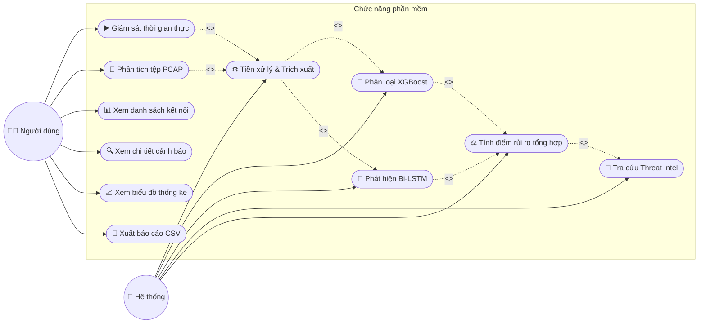

# Sơ đồ Use Case - Hệ thống phát hiện C&C

Dưới đây là sơ đồ Use Case đã được cập nhật, tập trung hoàn toàn vào 2 tác nhân là **Người dùng** và **Hệ thống** theo yêu cầu của bạn.

## Sơ đồ Mermaid

## Giải thích chi tiết

### 1. Tác nhân (Actors)
- **Người dùng:** Chủ thể trực tiếp tương tác với phần mềm thông qua Giao diện đồ họa (GUI). Người dùng ra lệnh thu thập, tải file lên và xem các báo cáo kết quả.
- **Hệ thống:** Tác nhân ngầm đóng vai trò tự động hóa. Hệ thống chịu trách nhiệm chạy nền các quy trình phức tạp (tính toán, học máy, kết nối mạng) để phục vụ cho Người dùng mà không cần con người can thiệp thủ công.

### 2. Phân chia Use Case
**Nhóm do Người dùng chủ động tương tác:**
- **Giám sát thời gian thực:** Ra lệnh bắt gói tin từ card mạng nội bộ.
- **Phân tích tệp PCAP:** Tải lên file lưu lượng ngoại tuyến.
- **Xem danh sách / chi tiết / biểu đồ:** Khai thác dữ liệu hiển thị trên các bảng điều khiển.
- **Xuất báo cáo:** Kết xuất dữ liệu luồng ra tệp CSV để lưu trữ.

**Nhóm do Hệ thống tự động thực thi:**
- **Tiền xử lý & Trích xuất:** Tự động gom luồng và tạo véc-tơ đặc trưng (bảng hoặc chuỗi) ngay khi có dữ liệu.
- **Phân loại bằng XGBoost & Bi-LSTM:** Tự động đẩy véc-tơ vào các mô hình trí tuệ nhân tạo để lấy xác suất độ độc hại.
- **Tra cứu tình báo & Tính điểm rủi ro:** Tự động tổng hợp xác suất học máy và đối chiếu chéo (Threat Intel) để trả về kết quả hiển thị cho người dùng.
